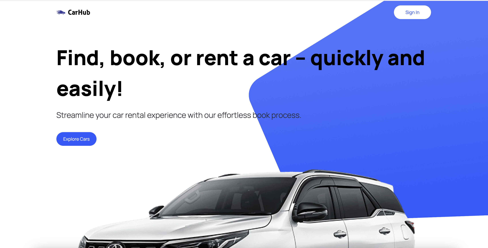
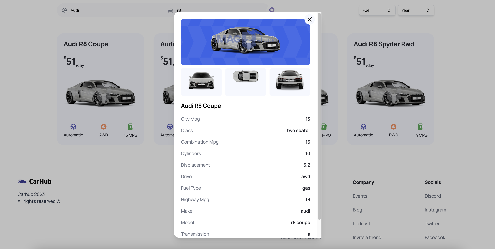

# Car Showcase - ReactJS

## 📷 Screenshot

  
  

## 📝 Project Description

The Car Showcase app allows users to search for a make and model of a car and view the details.

## 📚 Technologies

- [ReactJS](https://reactjs.org/)
- [NextJS](https://nextjs.org/)
- [Tailwind CSS](https://tailwindcss.com/)
- [Vercel](https://vercel.com/dashboard)
- [API: RapidAPI](https://rapidapi.com/apininjas/api/cars-by-api-ninjas)
